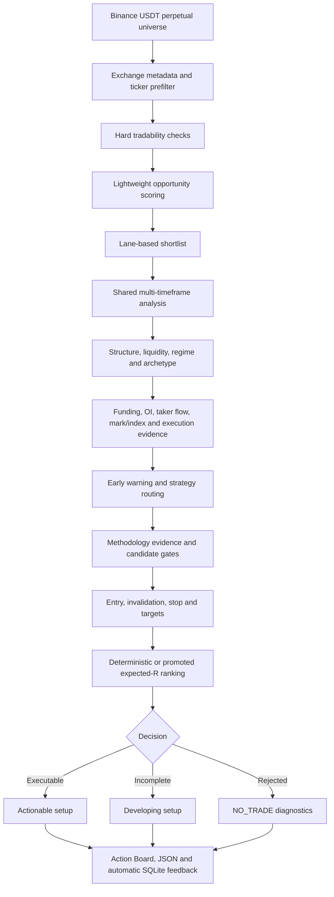

# Apex Trading Agent

<p align="center"><strong>Data-driven Binance USDT perpetual-futures discovery, early-warning analysis, trade-setup ranking, and chronological research.</strong></p>

<p align="center"><code>Python 3.11+</code> · <code>Typer</code> · <code>Pydantic v2</code> · <code>scikit-learn</code> · <code>SQLite</code> · <code>Ruff</code> · <code>mypy</code> · <code>pytest</code></p>

---

Apex scans Binance USDT perpetual-futures markets, shortlists symbols with useful opportunity characteristics, combines completed-candle structure with derivatives participation evidence, routes canonical strategies, evaluates entry/stop/target geometry, and explains why a setup is ready, conditional, developing, rejected, or unavailable.

The VNext engine also supports checksum-verified historical campaigns, classical probability models, expected-R ranking, and invisible local outcome reconciliation. Historical probability remains withheld until an artifact passes every final-test promotion gate.

> **Scope:** Apex is an analysis product. It does not place orders, manage exchange accounts or wallets, recommend leverage, or guarantee profitable trades.

## What Apex answers

Apex is designed to answer seven practical questions:

1. Which markets deserve deeper analysis?
2. Is there a structurally valid long or short setup?
3. Is the setup executable now, developing, late, missed, or invalidated?
4. Where are the entry zone, structural invalidation, stop, and realistic targets?
5. What evidence, contradictions, quality gates, and rejection reasons produced the decision?
6. Is price participation consistent with breakout preparation, genuine positioning, covering, liquidation, crowding, exhaustion, or contradictory evidence?
7. Is a historically calibrated edge available, and if so, what are its expected R, probability interval, and sample size?

## Public CLI

```text
apex scan
apex analyze SYMBOL
apex backtest [SYMBOL]
apex config-check
apex version
```

| Command | Purpose |
|---|---|
| `apex scan` | Discover, shortlist, fully analyze, and rank futures opportunities. |
| `apex analyze SYMBOL` | Run the shared full-analysis pipeline for one symbol. |
| `apex backtest SYMBOL` | Run a chronological production-path replay for one symbol. |
| `apex backtest --campaign` | Build or inspect a point-in-time public-data research campaign. |
| `apex config-check` | Validate and display resolved configuration. |
| `apex version` | Display the installed package version. |

Detailed command examples are available in [`commands.md`](commands.md).

## End-to-end workflow



`scan` and `analyze` use the same full-analysis core after symbol selection. `scan` selects symbols from the market universe; `analyze` sends the requested symbol directly to that core.

## 1. Market discovery and shortlisting

The scanner separates **tradability** from **opportunity quality**.

### Hard tradability

A market must first satisfy execution and data requirements such as:

- active Binance USDT perpetual contract;
- valid exchange filters and symbol metadata;
- sufficient quote volume;
- acceptable spread;
- sufficient candle history;
- fresh and continuous market data;
- usable volatility and execution conditions.

Recent percentage movement is not a mandatory tradability requirement. The default `minimum_absolute_movement_percentage` is `0.0`.

### Lightweight opportunity score

Surviving markets are scored using configured components including:

- liquidity;
- movement and acceleration;
- relative volume;
- volatility usability;
- entry freshness;
- proximity to structure;
- directional clarity;
- spread quality;
- noise quality.

The discovery stage decides which symbols deserve expensive full analysis. It cannot approve a trade. Lane scores are cross-sectional percentiles, preventing capped `100.0` scores from hiding relative differences between symbols.

### Shortlist lanes

Apex reserves shortlist coverage for different opportunity shapes rather than filling the list with only the largest movers. Lanes can include:

- trend continuation;
- compression or expansion;
- fresh breakout or breakdown;
- fast mover;
- range boundary or rejection;
- benchmark-relative strength or weakness;
- developing setup.

## 2. Shared multi-timeframe analysis

The default analysis set is:

| Timeframe | Configured role | Main use |
|---|---|---|
| `4h` | macro | broad structure, major levels and obstacles |
| `1h` | intermediate | directional context and intermediate structure |
| `30m` | intraday | intraday structure and setup context |
| `15m` | setup | setup formation, ranges, pullbacks and boundaries |
| `5m` | entry | activation and execution structure |
| `3m` | refinement | entry refinement and local geometry |
| `1m` | timing | optional immediate timing |

For every timeframe, Apex loads candles and builds a `TimeframeContext` containing:

- latest closed price;
- optional active-candle price;
- ticker price and selected current-price source;
- spread and order-book observations when available;
- exchange tick size, step size and minimum notional;
- staleness and data-confidence information;
- feature snapshot;
- shared structure analysis;
- liquidity analysis;
- recent candles.

The analysis price is based on the latest closed candle. Live ticker or active-candle price can be retained separately for current-price and entry-distance evaluation.

## 3. Structure and liquidity model

Apex analyzes structure before treating indicators as supporting evidence. The structure/liquidity layer can provide:

- trend direction and strength;
- confirmed swing highs and lows;
- support and resistance zones;
- range boundaries and midpoint;
- breakout or breakdown state;
- retest and polarity information;
- failed-break and reclaim context;
- liquidity sweeps and rejection evidence;
- compression or expansion context;
- nearest upside and downside obstacles;
- available movement room.

This information is passed into strategy contexts and is also exposed in public analysis output for auditability.

## 4. Indicators and evidence

The default feature registry currently supplies the analysis context with:

| Feature | Typical purpose |
|---|---|
| ATR 14 | volatility, stop noise, extension and geometry normalization |
| EMA 20 / EMA 50 | trend and pullback context |
| VWAP | acceptance, reclaim, rejection and location context |
| RSI 14 | momentum condition |
| RSI slope | momentum direction and change |
| MACD histogram | momentum expansion or deterioration |
| ROC 12 | directional acceleration |
| Relative volume 20 | participation and expansion quality |
| Recent range position 20 | location inside recent structure |
| Candle range ratio 20 | compression and volatility expansion |
| Structure trend strength | structural directional quality |

Indicators are categorized evidence, not independent trade votes. Correlated observations are grouped so repeated versions of momentum or trend information cannot freely inflate candidate quality.

### Futures evidence and early warning

When `futures_evidence_enabled` is on, Apex gathers a timestamped, fail-soft evidence bundle containing:

- kline quote volume, trade count, and taker-buy base/quote volume;
- funding history;
- open-interest level, change, and acceleration;
- taker buy/sell flow;
- mark price, index price, and premium/basis;
- ticker spread, order-book depth, and exchange execution filters;
- freshness, source provenance, and explicit missing-data reasons.

A single order-book snapshot is execution-quality evidence only. Apex does not copy its imbalance across timeframes as directional confirmation, and unavailable OI, funding, or depth is never silently converted to zero.

The price/OI/flow matrix can report:

- breakout or breakdown preparation;
- bullish or bearish participation;
- short covering or long liquidation;
- crowded-long or crowded-short fragility;
- exhaustion/reversal watch;
- contradictory, insufficient, or neutral evidence.

Price structure establishes direction. Derivatives evidence can strengthen, weaken, or classify that move, but cannot authorize a standalone trade.

### Regime stability and coin archetypes

Regime output includes a state probability, persistence estimate, and transition warning. A hysteresis guard is available to stop low-confidence state changes from flipping routing candle by candle. Symbols are classified as majors, liquid alts, momentum alts, insufficient-history listings, or benchmark-decoupled markets when the required benchmark evidence exists.

## 5. Strategy model

Apex keeps detailed strategy implementations while normalizing them into canonical setup families.

| Canonical family | Current strategy implementations mapped into it |
|---|---|
| `TREND_PULLBACK` | trend pullback, first-pullback continuation, VWAP reclaim/rejection |
| `BREAK_CONTINUATION` | momentum breakout, breakout continuation, momentum scalp |
| `BREAK_RETEST` | breakout retest |
| `COMPRESSION_EXPANSION` | compression expansion |
| `RANGE_REJECTION` | range reversal |
| `FAILED_BREAK_RECLAIM` | failed-breakout reversal |
| `LIQUIDITY_SWEEP_REVERSAL` | liquidity-rejection reversal, exhaustion reversal |

The default enabled strategies are configured in `config/default.yaml`.

Each candidate contains a direction, entry geometry, invalidation, targets, evidence, structural references, actionability state, metadata, quality dimensions, and rejection information. Candidates representing materially the same thesis can be grouped during ranking to reduce duplicate aliases.

## 6. Setup maturity and actionability

A valid setup is not automatically executable. Apex distinguishes setup quality from current actionability.

Common public states include:

| State | Meaning |
|---|---|
| `READY_NOW` | Configured execution conditions are complete near current price. |
| `AGGRESSIVE_NOW` | An immediate but explicitly cautious entry is available. |
| `PULLBACK_PREFERRED` | Direction may be valid, but a retracement offers better geometry. |
| `RETEST_PREFERRED` | A level retest is the preferred execution path. |
| `RECLAIM_REQUIRED` | Price must regain a stated level before entry. |
| `APPROACHING_ENTRY` | Price is near an incomplete entry condition. |
| `WAIT_FOR_CLOSE` | Candle completion is required. |
| `DEVELOPING_SETUP` | A measurable setup exists but is not executable yet. |
| `LATE_ENTRY` | Direction may remain valid, but entry quality has deteriorated. |
| `MISSED_ENTRY` | The planned geometry is no longer realistically available. |
| `INVALIDATED` | The structural thesis has failed. |
| `NO_TRADE` | No candidate survived analysis and selection. |

These states describe setup condition, not certainty or win probability.

## 7. Entry, invalidation, stop and targets

A selected setup can expose:

- current price and current-price source;
- immediate and preferred entry zones;
- ideal entry;
- maximum acceptable or chase boundary;
- structural invalidation level and rule;
- stop-loss price and stop-quality diagnostics;
- one or more structural targets;
- movement percentage and reward multiple;
- target role, source, reachability and conditions;
- expected holding category and expiry;
- management guidance.

### Geometry

For a long setup:

```text
risk per unit = entry - stop
reward per unit = target - entry
reward-to-risk = reward per unit / risk per unit
movement % = (target - entry) / entry × 100
```

For a short setup:

```text
risk per unit = stop - entry
reward per unit = entry - target
reward-to-risk = reward per unit / risk per unit
movement % = (entry - target) / entry × 100
```

Targets are intended to come from observable structure, liquidity, range geometry, prior swings, accepted breaks, or conditional expansion. Apex does not require every setup to have three targets or a fixed 10% objective.

## 8. Decision and ranking flow

```mermaid
flowchart LR
    A[Data quality] --> B[Market usability]
    B --> C[Structure and regime]
    C --> D[Strategy compatibility]
    D --> E[Candidate generation]
    E --> F[Entry validity]
    F --> G[Invalidation and stop]
    G --> H[Target feasibility]
    H --> I[Actionability]
    I --> J[Quality scoring]
    J --> K[Deduplication and ranking]
    K --> L[Selected, developing or NO_TRADE]
```



Quality and ranking values are deterministic analytical scores. They are not calibrated accuracy percentages or guaranteed probabilities.

When a compatible promoted runtime artifact exists, positive expected R becomes the primary candidate rank key:

```text
Expected R = P(fill) × Σ[P(outcome) × outcome R] − expected costs
```

ML cannot repair stale data, unusable liquidity, invalid geometry, missing invalidation, or absent target room. If the artifact is missing, stale, incompatible, corrupt, or fails promotion, Apex keeps deterministic ranking and labels historical edge unavailable.

## 9. Methodology authority and current gate mode

[`docs/trade_plan.md`](docs/trade_plan.md) is the stable methodology authority. Runtime records include the methodology identity:

```text
methodology_path: docs/trade_plan.md
methodology_version: trade-plan-v1
```

The current default configuration is:

```yaml
methodology_gate_mode: shadow
```

Shadow mode calculates and exposes methodology routing and diagnostic results while preserving the established public decision path for comparison. It does **not** mean every methodology conflict is currently an enforced hard rejection. Change this only with reviewed implementation and behavioral validation.

### Historical research and ML authority

`apex backtest --campaign` supports the latest 24 complete UTC months by default. Campaign infrastructure can build a monthly top-30 point-in-time universe from the previous month's quote volume, download Binance USD-M public archives resumably, verify official SHA-256 checksums, and retain unavailable evidence as missing.

The classical-ML layer compares fixed-seed regularized logistic regression with histogram gradient boosting for entry fill, post-fill outcome, and early-warning models. It uses chronological 60/20/20 partitions, purge/embargo boundaries, validation-only isotonic calibration, and untouched final-test metrics.

Probability authority is withheld unless all configured gates pass, including sample size, positive net expectancy after costs, Brier skill, calibration error, deflated-Sharpe probability, PBO, leakage, stability, and artifact integrity. An unpromoted model is a valid research result and does not make the application fail.

## 10. Output and diagnostics

### Text output

The default terminal view uses bold, separated, width-aware cards instead of raw field dumps. `scan` is a concise Action Board listing ready, conditional, and developing opportunities while summarizing late, invalidated, and no-setup markets as counts. `analyze` leads with the decision, then shows market context, setup geometry, activation, invalidation, targets, early warning, historical-edge authority, main evidence, and main concern in plain language. `backtest`, `config-check`, and `version` use the same presentation system.

Use `--explain` with `scan` or `analyze` for extra readable diagnostic sections. It does not append a raw JSON dump; use `--output json` when complete machine-readable evidence is required.

### JSON output

JSON output provides machine-readable details such as:

- methodology and schema identity;
- decision and strategy family/subtype;
- setup and developing setup;
- evaluated timeframes and data quality;
- shared structure map and alignment diagnostics;
- strategy routing;
- candidate ranking;
- methodology evidence and rejection reasons;
- zero-trade diagnostics;
- market archetype, regime probability/persistence, and early-warning evidence;
- futures-evidence availability, freshness, basis, flow, and execution metadata;
- expected R, probability interval, sample size, artifact version, and withholding reason.

### Invisible outcome feedback

Outcome tracking is enabled by default. Generated single-symbol opportunities are stored in `data/reports/analysis.db`; when the symbol is analyzed again, closed future candles reconcile pending entries, stops, targets, expiry, MFE, and MAE. Same-candle stop/target ambiguity is resolved conservatively as stop-first. This is internal accuracy feedback, not a paper-trading interface.

### Zero-trade diagnostics

Apex does not force a trade to fill a result quota. When no setup is executable, diagnostics can include:

- raw, retained, ranked and rejected candidate counts;
- developing candidate information;
- actionability-state distribution;
- canonical-family distribution;
- rejection-code distribution;
- top rejected reasons;
- methodology shadow-versus-enforcement details.

## 11. Installation

Requirements: Python 3.11 or newer.

```bash
git clone https://github.com/mshahwaiz-ali/apex.git
cd apex
python3 -m venv .venv
source .venv/bin/activate
python -m pip install --upgrade pip
python -m pip install -e ".[dev]"
```

Confirm the CLI:

```bash
apex --help
apex version
```

## 12. Practical usage

### Validate configuration

```bash
apex config-check
```

### Scan the market

```bash
apex scan
apex scan --results 10
apex scan --shortlist 50 --results 10
apex scan --direction long
apex scan --direction short
apex scan --explain
apex scan --output json
```

`--shortlist` controls how many screened symbols receive full multi-timeframe analysis. `--results` controls the maximum number displayed after ranking. Apex may return fewer results.

### Analyze one symbol

```bash
apex analyze BTCUSDT
apex analyze BTCUSDT --explain
apex analyze ETHUSDT --output json
apex analyze BTCUSDT --candles 300
```

`analyze` bypasses universe discovery but uses the same full-analysis core as `scan`.

### Save additional analysis records

Apex automatically stores analysis opportunities and future outcome feedback in `data/reports/analysis.db` when `outcome_tracking_enabled: true`. The options below add explicit JSONL output or choose another SQLite path.

```bash
apex scan --record data/records/scan_history.jsonl
apex scan --record-db data/records/apex_analysis.sqlite3
apex analyze BTCUSDT --record data/records/manual_analysis.jsonl
apex analyze BTCUSDT --record-db data/records/apex_analysis.sqlite3
```

### Write a full scan report

```bash
apex scan --report data/reports/latest_scan.json
```

### Run chronological replay

```bash
apex backtest BTCUSDT
apex backtest BTCUSDT --output json
apex backtest BTCUSDT --decision-points 10
apex backtest BTCUSDT --replay-timeframe 5m --replay-candles 24
apex backtest BTCUSDT --funding-pct 0.01
```

The backtest command:

1. downloads closed historical candles;
2. creates non-overlapping decision timestamps;
3. exposes only the historical prefix available at each timestamp;
4. runs the production symbol-analysis path;
5. converts selected setups into replay signals;
6. models entry, stop, targets, partial exits, fees, slippage, optional funding, expiry and conservative same-candle ambiguity;
7. reports trades, no-trade decisions, calibration records and campaign metrics.

Reported metrics include expectancy, profit factor, win/loss rates, average win/loss, realized R, maximum drawdown, fill rate, expiry rate, missed entries, MFE and MAE. Chronological partitions are labeled `training`, `validation`, and `final_test`, but current output explicitly marks calibration as non-authoritative.

This is not a portfolio backtester and does not model leverage, wallet allocation, margin, liquidation, paper accounts or live execution.

### Run a public-data campaign

```bash
# Build the default latest-24-complete-month, point-in-time top-30 campaign.
apex backtest --campaign --download-missing

# Bound the campaign and write a machine-readable report.
apex backtest --campaign \
  --start 2025-01 \
  --end 2025-06 \
  --download-missing \
  --report data/research/campaign-report.json \
  --output json

# Train from existing campaign feature_rows.jsonl and saved membership.
apex backtest --campaign \
  --symbols-file data/research/binance_um/universe_by_month.json \
  --train-model \
  --output json
```

Campaign data defaults to `data/research/binance_um/`, which is git-ignored. `--download-missing` may transfer substantial kline, funding-rate, and aggregate-trade archives. Downloads are resumable and checksum verified.

`--symbols-file` accepts either a JSON symbol list or a month-to-symbol mapping for controlled campaigns:

```json
{
  "2025-01": ["BTCUSDT", "ETHUSDT"],
  "2025-02": ["BTCUSDT", "ETHUSDT", "SOLUSDT"]
}
```

If no universe file exists, `--download-missing` builds monthly membership from trailing Binance quote volume. `--train-model` trains only when point-in-time feature rows are present; otherwise the report truthfully states why training was withheld.

## 13. Configuration

The primary runtime file is [`config/default.yaml`](config/default.yaml). Major sections include:

```text
futures_screener
market_environment
strategy_routing
analysis_timeframes
timeframe_roles
timeframe_resampling_sources
timeframe_max_staleness_seconds
methodology_gate_mode
futures_evidence_enabled
outcome_tracking_enabled
```

Important defaults include:

- shortlist size: `36`;
- ticker prefilter size: `120`;
- screening candle timeframe: `5m`;
- full-analysis timeframes: `1m, 3m, 5m, 15m, 30m, 1h, 4h`;
- methodology gate: `shadow`;
- futures-specific evidence: enabled with fail-soft missing-data handling;
- invisible SQLite outcome tracking: enabled at `data/reports/analysis.db`.

Always run `apex config-check` after changing YAML.

## 14. Repository architecture

```text
apex/
├── config/                  # Runtime YAML configuration
├── docs/                    # Methodology and project documentation
├── tests/                   # Unit and behavioral tests
├── commands.md              # CLI reference
├── pyproject.toml           # Package and quality-tool configuration
└── src/apex/
    ├── application/         # Discovery, orchestration, methodology, records
    ├── backtesting/         # Historical providers, replay and metrics
    ├── cli_commands/        # scan, analyze, backtest and system commands
    ├── config/              # Pydantic settings and YAML loading
    ├── data/                # Binance providers and normalized market data
    ├── domain/              # Core domain contracts
    ├── features/            # Indicator registry and calculations
    ├── liquidity/           # Liquidity zones, sweeps and rejection evidence
    ├── market_analysis/     # Shared structure and liquidity analysis
    ├── market_environment/  # Market-state classification and routing context
    ├── presentation/        # Deterministic text rendering
    ├── research/            # Public-data campaigns, splits, ML and promotion metrics
    ├── scoring/             # Quality, consensus, deduplication and ranking
    └── strategies/          # Strategy contracts and generators
```

## 15. Development and validation

```bash
cd ~/data_drive/apex
git pull --rebase origin main
source .venv/bin/activate
```

For changed Python files:

```bash
.venv/bin/ruff format <changed-files>
.venv/bin/ruff check <changed-files> --fix
.venv/bin/ruff check <changed-files>
.venv/bin/mypy <changed-modules>
.venv/bin/pytest <relevant-tests>
git diff --check
```

For documentation-only changes, run at minimum:

```bash
git diff --check
```

Never report Ruff, mypy, pytest, CLI, live-scan or backtest validation as passed unless the actual command output was observed.

## 16. Important interpretation rules

- `READY_NOW` does not mean guaranteed profit.
- A high analytical score is not a calibrated win probability.
- An early-warning direction is participation context, not standalone entry authority.
- Expected R and calibrated intervals are displayed only from promoted compatible artifacts.
- `NO_TRADE` can be the correct professional result.
- Discovery rank only grants deeper analysis; it never approves a trade.
- Developing setups should be monitored separately from executable setups.
- Historical replay measures deterministic behavior on selected data; it does not prove future profitability.
- Binance data availability, market conditions, fees, spread and slippage can materially affect real outcomes.
- Historical validation can reduce uncertainty but cannot guarantee future profitability.

## Documentation

- [`docs/trade_plan.md`](docs/trade_plan.md) — methodology authority
- [`commands.md`](commands.md) — complete CLI reference
- [`config/default.yaml`](config/default.yaml) — active default configuration

---

<p align="center"><strong>Apex favors explicit structure, deterministic decisions, auditable evidence, and honest NO_TRADE outcomes over forced signals.</strong></p>
