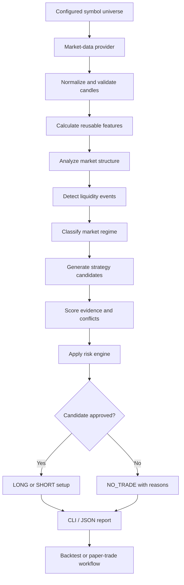

<div align="center">

# ⚡ Apex Trading Agent

### Deterministic, explainable and risk-aware crypto market analysis

Apex analyzes live multi-timeframe cryptocurrency data, detects structured trading opportunities, ranks actionable setups and applies strict risk controls before producing a decision.

[](https://www.python.org/)
[](#project-status)
[](#architecture)
[](#execution-safety)
[](#license)

**Live data · Multi-timeframe analysis · Strategy scoring · Structured risk · Backtesting · Paper trading · Safe testnet foundations**

</div>

---

## Overview

**Apex Trading Agent** is a modular Python system for crypto-market analysis and opportunity selection.

It is designed to answer one central question:

> Given the current market conditions, what is the strongest actionable trading setup available near the current price?

Instead of relying on a single indicator or an opaque AI-generated prediction, Apex combines:

* live OHLCV market data;
* multi-timeframe trend and momentum analysis;
* volatility, volume and price-location features;
* market-structure interpretation;
* liquidity and trap detection;
* deterministic strategy generation;
* transparent candidate scoring;
* stop, target, position-size and leverage validation;
* historical simulation and forward paper tracking.

For every analyzed market, Apex produces one of three decisions:

```text
LONG
SHORT
NO_TRADE
```

A trade is only approved when its market evidence, entry quality and risk structure pass the configured validation rules.

---

## Why Apex Exists

Most basic trading bots fall into one of two categories:

1. **Indicator voters** that count bullish and bearish signals without understanding market context.
2. **Black-box predictors** that provide a direction without a clear explanation or controlled invalidation.

Apex takes a different approach.

It treats a trade as a structured hypothesis containing:

* a directional thesis;
* supporting market evidence;
* contradicting evidence;
* an actionable entry zone;
* a structural invalidation point;
* realistic targets;
* measurable risk-to-reward;
* leverage constraints;
* explicit rejection reasons.

Aggressive opportunity discovery is allowed.

Uncontrolled risk is not.

---

## Core Principles

### Deterministic first

Core decisions are produced by reproducible Python logic rather than an LLM.

This makes the engine:

* testable;
* explainable;
* auditable;
* repeatable;
* suitable for backtesting;
* independent of paid AI APIs.

### Evidence over indicator voting

A setup is not approved merely because several indicators agree.

Apex evaluates combined evidence from:

* trend;
* momentum;
* volatility;
* volume;
* market structure;
* liquidity behavior;
* price location;
* timeframe alignment;
* risk quality.

### Near-market entries

The system prefers entries that remain actionable near the current market price.

It also applies chase protection when:

* price has moved too far from the logical entry;
* the stop has become excessively wide;
* risk-to-reward has deteriorated;
* the breakout is already extended;
* insufficient target space remains.

### Risk before leverage

Leverage is treated as a risk parameter, not as a profit multiplier.

A setup can be rejected even when its directional thesis is strong if:

* liquidation would sit too close to the stop;
* position risk exceeds configured limits;
* correlated exposure is excessive;
* the stop is structurally invalid;
* expected reward is insufficient.

### No fake certainty

Apex does not promise guaranteed returns or impossible win rates.

System quality must be judged through:

* expectancy;
* profit factor;
* drawdown;
* out-of-sample performance;
* forward paper results;
* sensitivity to fees and slippage;
* performance across symbols and regimes.

---

## Current Capabilities

Apex currently contains foundations and deterministic implementations covering the complete planned roadmap.

| Area          | Current capability                                                  |
| ------------- | ------------------------------------------------------------------- |
| Configuration | Validated YAML and environment-based settings                       |
| Market data   | Public candle and ticker retrieval through provider abstractions    |
| Timeframes    | `1m`, `3m`, `5m`, `15m`, `30m`, `1h`, `4h`                          |
| Features      | Trend, momentum, volatility, volume and price-location calculations |
| Structure     | Swings, trend classification, ranges and structural events          |
| Liquidity     | Liquidity zones, sweeps, rejection and trap-related evidence        |
| Strategies    | Independent long and short candidate generation                     |
| Scoring       | Explainable normalized candidate assessment                         |
| Risk          | Entries, stops, targets, sizing, leverage and exposure checks       |
| Analysis      | Complete single-symbol deterministic pipeline                       |
| Scanner       | Multi-symbol opportunity analysis and ranking                       |
| Backtesting   | Conservative deterministic trade simulation                         |
| Paper trading | Persistent local trade recording and lifecycle updates              |
| Optimization  | Baseline-versus-candidate performance comparison                    |
| Intelligence  | Optional metadata-only market intelligence                          |
| Execution     | Disabled-by-default, guarded, testnet-only execution foundation     |
| Reporting     | Human-readable output and machine-readable JSON                     |
| Quality       | Ruff, mypy, pytest, coverage and GitHub Actions                     |

---

## Analysis Pipeline

Apex separates data collection, interpretation, strategy logic and risk approval.



The provider does not decide trades.

Strategies do not size positions.

The scoring engine does not bypass risk.

Execution remains isolated from analysis.

---

## Multi-Timeframe Model

Each timeframe has a defined analytical responsibility.

| Timeframe | Primary role                                                  |
| --------- | ------------------------------------------------------------- |
| `4h`      | Macro trend, major structure and important support/resistance |
| `1h`      | Intermediate bias, structural transitions and momentum regime |
| `30m`     | Intraday context, key levels and volatility regime            |
| `15m`     | Primary setup formation and directional structure             |
| `5m`      | Entry structure, local liquidity and stop placement           |
| `3m`      | Entry refinement and micro momentum                           |
| `1m`      | Precise timing and immediate liquidity events                 |

The `1m` timeframe is never intended to define the complete trade thesis by itself.

Higher timeframes provide context.

Lower timeframes provide execution detail.

Perfect alignment across every timeframe is not required, but severe contradiction can reduce confidence or reject a setup.

---

## Architecture

Apex follows a modular `src`-layout architecture.

```text
apex/
├── .github/
│   └── workflows/               # Continuous-integration workflows
├── config/
│   ├── default.yaml             # Runtime and feature configuration
│   ├── risk.yaml                # Risk-engine limits and profiles
│   ├── strategies.yaml          # Strategy configuration
│   └── symbols.yaml             # Scanner symbol universe
├── data/                        # Local runtime output; normally ignored
│   ├── cache/
│   ├── execution/
│   ├── optimization/
│   ├── paper_trading/
│   └── reports/
├── docs/
│   ├── plan.md                  # Authoritative product roadmap
│   ├── validation-gates.md      # Current validation-gate status
│   └── ...                      # Implementation and handoff notes
├── logs/                        # Runtime logs
├── scripts/                     # Development and operational helpers
├── src/
│   └── apex/
│       ├── application/         # End-to-end orchestration and reporting
│       ├── backtesting/         # Historical signal simulation
│       ├── config/              # Validated settings and loaders
│       ├── data/                # Provider adapters, cache and validation
│       ├── domain/              # Provider-independent domain contracts
│       ├── execution/           # Guarded testnet-only execution layer
│       ├── features/            # Reusable technical calculations
│       ├── intelligence/        # Optional metadata-only intelligence
│       ├── liquidity/           # Sweeps, traps and liquidity evidence
│       ├── monitoring/          # Runtime observability foundations
│       ├── optimization/        # Baseline/candidate evaluation
│       ├── paper_trading/       # Forward paper-trade lifecycle
│       ├── reporting/           # Text and JSON presentation
│       ├── risk/                # Stops, targets, sizing and leverage
│       ├── scanner/             # Multi-symbol ranking
│       ├── scoring/             # Candidate scoring and selection
│       ├── storage/             # Local persistence abstractions
│       ├── strategies/          # Independent strategy families
│       ├── structure/           # Swings, trends and ranges
│       ├── __init__.py
│       └── cli.py               # Typer command-line interface
├── tests/
│   ├── backtesting/
│   ├── fixtures/
│   ├── integration/
│   ├── regression/
│   └── unit/
├── .env.example
├── .gitignore
├── plan.md
├── pyproject.toml
└── README.md
```

> Runtime directories may only appear after their corresponding commands have been executed.

---

## Architectural Boundaries

### Domain

Contains provider-independent business models and invariants.

Typical concepts include:

* candles and ticker snapshots;
* timeframe analyses;
* trade candidates;
* approved setups;
* risk profiles;
* backtest trades;
* paper trades;
* execution intents.

The domain layer must not depend directly on exchange APIs.

### Data

Responsible for:

* provider communication;
* candle and ticker retrieval;
* symbol normalization;
* response validation;
* retry behavior;
* rate-limit handling;
* caching;
* provider error translation.

### Features

Calculates reusable deterministic values such as:

* moving averages;
* RSI and momentum measurements;
* ATR and volatility measures;
* Bollinger-related location;
* volume statistics;
* price extension;
* distance from important levels.

### Structure and liquidity

Interpret raw candles into market behavior:

* swing highs and lows;
* directional structure;
* ranges and compression;
* structural breaks;
* liquidity zones;
* sweeps and rejection;
* failed breakouts;
* trap evidence.

### Strategies

Generate trade candidates independently.

A strategy describes:

* direction;
* entry concept;
* invalidation concept;
* target concept;
* supporting factors;
* contradictions.

A strategy does **not** directly override portfolio risk.

### Scoring

Produces transparent and comparable candidate scores.

Possible components include:

```text
trend alignment
structure quality
entry quality
momentum
volume
liquidity evidence
volatility suitability
risk-to-reward
stop quality
extension penalty
conflict penalty
data confidence
```

### Risk

Converts a promising candidate into either:

* an approved structured setup; or
* a rejected candidate with reasons.

Risk validation covers:

* practical entry bounds;
* stop placement;
* target validity;
* account-risk sizing;
* leverage limits;
* liquidation distance;
* concurrent exposure;
* correlated exposure.

### Application

Coordinates the complete workflow without embedding low-level provider or strategy details.

---

## Installation

### Requirements

* Python `3.11+`
* Git
* Linux, macOS or Windows
* Internet access for live public market data

Ubuntu is the primary local development environment.

### Clone the repository

```bash
git clone https://github.com/mshahwaiz-ali/apex.git
cd apex
```

### Create a virtual environment

```bash
python3 -m venv .venv
source .venv/bin/activate
```

### Install Apex with development tools

```bash
python -m pip install --upgrade pip
python -m pip install -e ".[dev]"
```

### Confirm installation

```bash
apex version
apex validate-config
apex smoke
```

The `smoke` command performs a minimal application bootstrap check.

---

## Configuration

Default runtime configuration is stored under `config/`.

The standard configured analysis timeframes are:

```yaml
analysis_timeframes:
  - 1m
  - 3m
  - 5m
  - 15m
  - 30m
  - 1h
  - 4h
```

Advanced intelligence is disabled by default:

```yaml
advanced_intelligence_enabled: false
intelligence_funding_enabled: false
intelligence_open_interest_enabled: false
intelligence_correlation_enabled: false
```

Configuration responsibilities are separated into logical files:

```text
config/default.yaml      General runtime behavior
config/symbols.yaml      Scanner universe
config/strategies.yaml   Strategy rules and thresholds
config/risk.yaml         Account, exposure and leverage controls
```

Validate the active configuration with:

```bash
apex validate-config
```

Sensitive values must be supplied through environment variables and must never be committed.

---

## Command-Line Interface

Display the complete command list:

```bash
apex --help
```

### Foundation commands

```bash
apex version
apex validate-config
apex smoke
```

---

## Live Market Data

### Fetch candles

```bash
apex fetch BTC/USDT --timeframe 15m --limit 50
```

Short options are also supported:

```bash
apex fetch BTC/USDT -t 5m -l 100
```

The command returns normalized candle objects as JSON.

### Fetch ticker

```bash
apex ticker BTC/USDT
```

Public-data commands do not require order-execution credentials.

---

## Analyze a Symbol

Run the complete deterministic pipeline:

```bash
apex analyze BTC/USDT
```

Select JSON output:

```bash
apex analyze BTC/USDT --output json
```

Control candle history:

```bash
apex analyze BTC/USDT --candles 300
```

Save a reusable report:

```bash
apex analyze BTC/USDT \
  --output json \
  --report data/reports/btc-analysis.json
```

A result may contain:

```json
{
  "symbol": "BTC/USDT",
  "decision": "LONG",
  "strategy": "liquidity_sweep_reversal",
  "current_price": 0,
  "entry_zone": {
    "low": 0,
    "high": 0
  },
  "stop_loss": 0,
  "take_profits": [],
  "confidence_score": 0,
  "supporting_evidence": [],
  "contradictions": [],
  "warnings": []
}
```

When no candidate passes validation, Apex returns `NO_TRADE` with explicit reasons.

---

## Scan Multiple Markets

The scanner loads symbols from `config/symbols.yaml`, analyzes each eligible market and ranks the available opportunities.

```bash
apex scan
```

JSON output:

```bash
apex scan --output json
```

Save the complete scan:

```bash
apex scan \
  --output json \
  --report data/reports/latest-scan.json
```

Use another symbol universe:

```bash
apex scan --symbols-file config/symbols.yaml
```

The scanner is designed so that one failed symbol does not invalidate the entire scan.

---

## Backtesting

Run a deterministic simulation for an approved setup:

```bash
apex backtest BTC/USDT
```

Specify the replay timeframe:

```bash
apex backtest BTC/USDT --replay-timeframe 5m
```

Request structured output:

```bash
apex backtest BTC/USDT --output json
```

The simulation considers execution-related factors such as:

* entry behavior;
* stop and target interaction;
* fees;
* slippage;
* realized R multiple;
* conservative intrabar assumptions.

The CLI backtest command is a focused simulation utility. It must not be interpreted as proof of strategy profitability across a statistically valid historical sample.

---

## Paper Trading

Paper trading allows approved setups to be recorded and followed without placing real orders.

### Record a setup

```bash
apex paper record BTC/USDT
```

If analysis does not produce an approved setup, no paper trade is created.

### Update open paper trades

```bash
apex paper update
```

Update a specific symbol:

```bash
apex paper update BTC/USDT
```

Choose the update timeframe:

```bash
apex paper update --timeframe 5m --candles 100
```

### View performance

```bash
apex paper report
```

JSON output:

```bash
apex paper report --output json
```

Paper-trade state is persisted locally under:

```text
data/paper_trading/
```

Typical lifecycle states include:

```text
generated
waiting_for_entry
entered
partially_closed
stopped
target_hit
expired
cancelled
invalidated
```

---

## Optimization

The optimization layer compares measurable performance rather than editing production settings blindly.

### Evaluate one performance report

```bash
apex optimize evaluate \
  --input data/reports/performance.json
```

### Compare a baseline and candidate

```bash
apex optimize compare \
  --baseline data/reports/baseline.json \
  --candidate data/reports/candidate.json
```

A candidate should not be accepted merely because it improves win rate.

The evaluator can reject changes that damage more important measures such as:

* expectancy;
* drawdown;
* profit factor;
* result stability.

Optimization reports are stored under:

```text
data/optimization/
```

Production configuration is not automatically rewritten.

Accepted candidates produce recommendations that can be reviewed deliberately.

---

## Optional Market Intelligence

Check intelligence status:

```bash
apex intelligence summary
```

Machine-readable output:

```bash
apex intelligence summary --output json
```

The intelligence package provides optional deterministic metadata for concepts such as:

* funding-rate context;
* open-interest context;
* cross-market correlation;
* broader market-risk summaries.

These features are disabled by default.

Intelligence metadata is not allowed to:

* approve a trade;
* bypass scoring;
* bypass risk;
* directly size a position;
* directly execute an order.

---

## Execution Safety

Apex does **not** contain unrestricted real-money execution.

The current execution foundation is:

* testnet-only;
* disabled by default;
* confirmation-gated;
* protected by duplicate-order keys;
* protected by maximum-notional rules;
* aware of daily-loss circuit-breaker input;
* controlled by a local kill switch;
* recorded in an audit log.

### Preview an execution intent

```bash
apex execute preview BTC/USDT
```

Previewing does not submit an order.

### Testnet submission

```bash
apex execute testnet BTC/USDT --confirm
```

Without explicit confirmation, submission must remain blocked.

### View execution status

```bash
apex execute status
```

### Enable the kill switch

```bash
apex execute kill-switch enable
```

Execution audit data is stored under:

```text
data/execution/audit.jsonl
```

No production exchange credential workflow or unrestricted real-money adapter should be added without separately passing the project's execution-readiness gates.

---

## Output Modes

Most analysis-oriented commands support human-readable text and JSON.

Human-readable output:

```bash
apex analyze BTC/USDT
```

JSON output:

```bash
apex analyze BTC/USDT --output json
```

Persistent report:

```bash
apex analyze BTC/USDT \
  --output json \
  --report data/reports/example.json
```

JSON output is suitable for:

* dashboards;
* notebooks;
* automation;
* regression comparison;
* report generation;
* external monitoring systems.

---

## Development Workflow

### Run linting

```bash
python -m ruff check .
```

### Verify formatting

```bash
python -m ruff format --check .
```

Apply formatting locally:

```bash
python -m ruff format .
```

### Run strict type checking

```bash
python -m mypy src
```

### Run tests

```bash
python -m pytest
```

### Run tests with coverage

```bash
python -m pytest \
  --cov=apex \
  --cov-report=term-missing
```

### Run the complete local gate

```bash
python -m ruff check .
python -m ruff format --check .
python -m mypy src
python -m pytest --cov=apex --cov-report=term-missing
git diff --check
```

No implementation should be considered complete solely because it runs once.

Tests and validation gates are the source of truth.

---

## Testing Strategy

Apex uses several levels of validation.

### Unit tests

Focused deterministic behavior:

* candle validation;
* technical features;
* swing detection;
* liquidity detection;
* strategy rules;
* scoring;
* stop and target calculations;
* sizing;
* leverage constraints;
* configuration loading.

### Integration tests

Module interactions:

* provider adapters;
* caching;
* full symbol analysis;
* scanner behavior;
* CLI commands;
* storage and reporting.

### Regression tests

Every confirmed bug should receive a test that prevents recurrence.

### Fixture-based tests

Representative market scenarios may include:

* uptrend pullback;
* downtrend pullback;
* bull trap;
* bear trap;
* liquidity sweep;
* false breakout;
* compression;
* extreme volatility;
* flat market;
* missing data.

### Invariant tests

Critical invariants include:

```text
candle high >= candle low
long stop < long entry
short stop > short entry
targets are directionally valid
position risk stays within limits
liquidation remains safely beyond invalidation
no result contains NaN or infinity
```

---

## Validation Gates

Development progress is separated from trading viability.

### Gate 1 — Technical correctness

Requires:

* passing unit and integration tests;
* deterministic results;
* valid numerical output;
* stable data handling;
* reproducible analysis.

### Gate 2 — Historical viability

Requires:

* positive expectancy on valid samples;
* acceptable drawdown;
* sufficient trade count;
* multi-symbol evidence;
* no lookahead leakage.

### Gate 3 — Out-of-sample viability

Requires:

* acceptable unseen-period performance;
* stable strategy behavior;
* no severe score-band collapse;
* controlled parameter sensitivity.

### Gate 4 — Forward paper viability

Requires:

* extended paper-trade evidence;
* realistic slippage behavior;
* operational stability;
* auditable setup history.

### Gate 5 — Execution readiness

Requires:

* tested kill switch;
* duplicate-order protection;
* maximum-loss controls;
* position reconciliation;
* testnet validation;
* secure credential handling.

Implementing a framework does not automatically mean that a viability gate has passed.

---

## Project Status

The repository contains implementation foundations across roadmap phases `0–12`.

### Implemented foundations

* repository and configuration foundation;
* live market-data access;
* technical feature engine;
* structure and liquidity analysis;
* strategy candidates;
* scoring and risk selection;
* CLI analysis and scanning;
* deterministic backtesting;
* persistent paper trading;
* optimization contracts and reports;
* optional intelligence metadata;
* guarded testnet execution foundations.

### Still requiring real-world validation

* curated historical datasets;
* broad multi-symbol backtest campaigns;
* out-of-sample studies;
* walk-forward evaluation;
* extended forward paper-trading samples;
* production threshold calibration;
* exchange-specific testnet adapter validation;
* execution reconciliation;
* any decision regarding real-money readiness.

The codebase may contain a complete architectural roadmap without the trading strategy itself being commercially or statistically proven.

---

## Safety Boundary

Apex is experimental trading-analysis software.

It is not:

* financial advice;
* a guarantee of profit;
* a guarantee of directional accuracy;
* a substitute for independent risk management;
* permission to use uncontrolled leverage;
* production-ready real-money execution software.

Cryptocurrency markets are highly volatile.

Losses can exceed expectations, particularly when leverage, illiquidity or execution slippage is involved.

Use analysis, backtesting and paper trading before considering any live-market integration.

---

## Security

Required security rules:

* never commit API keys;
* keep `.env` ignored;
* use `.env.example` only for safe placeholders;
* separate public-data credentials from execution credentials;
* use least-privilege permissions;
* never log secrets;
* validate all configuration;
* keep execution disabled by default;
* preserve an execution audit trail;
* never silently downgrade testnet safeguards.

---

## Repository Workflow

Repository:

```text
mshahwaiz-ali/apex
```

Primary branch:

```text
main
```

Development expectations:

* preserve modular boundaries;
* add tests with every feature or fix;
* keep changes focused;
* avoid unrelated rewrites;
* update documentation when behavior changes;
* never weaken risk invariants silently;
* do not claim completion before validation;
* keep `plan.md` authoritative for roadmap decisions.

---

## Design Non-Goals

Apex is intentionally not designed around:

* guaranteed-profit claims;
* opaque LLM trade decisions;
* martingale sizing;
* unlimited leverage;
* uncontrolled averaging into losses;
* automatic production execution;
* heavy distributed infrastructure;
* paid AI dependencies;
* a monolithic strategy file;
* provider-specific logic spread across the codebase.

---

## Roadmap Direction

Future work should focus on evidence rather than adding features for appearance.

Priority areas include:

1. Build curated and reproducible historical datasets.
2. Run broad strategy-specific backtests.
3. Measure results by regime, symbol and score band.
4. Establish a trustworthy baseline.
5. Perform out-of-sample and walk-forward testing.
6. Collect extended forward paper results.
7. Calibrate thresholds without overfitting.
8. Improve false-positive rejection.
9. Validate testnet execution and reconciliation.
10. Keep real-money execution isolated until every safety gate passes.

---

## Product Vision

The mature Apex system should be capable of:

1. Continuously ingesting multi-timeframe crypto data.
2. Understanding broader market regime and structure.
3. Detecting liquidity, traps, momentum and volatility.
4. Generating competing long and short candidates.
5. Rejecting weak, late or unsafe setups.
6. Ranking the strongest opportunities.
7. Producing practical entries near the current price.
8. Calculating structural stops and realistic targets.
9. Applying account, leverage and exposure limits.
10. Explaining every final decision.
11. Measuring performance through backtesting and paper trading.
12. Supporting optional execution through a separately guarded layer.

Apex is not intended to become another generic indicator dashboard.

The goal is a disciplined and aggressive crypto opportunity engine whose behavior can be inspected, tested and improved with evidence.

---

<div align="center">

### Built for structured experimentation—not blind prediction.

**Analyze carefully. Validate statistically. Risk deliberately.**

</div>

---

## License

This repository is proprietary.

Unless explicit permission is granted by the repository owner, the source code may not be copied, redistributed, sublicensed or used commercially.
