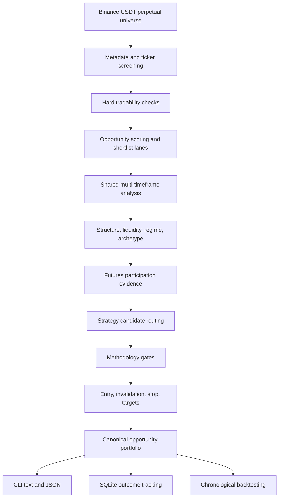

# Apex Trading Agent

<p align="center"><strong>Deterministic Binance USDT perpetual-futures discovery, analysis, backtesting, and historical research.</strong></p>

<p align="center"><code>Python 3.11+</code> · <code>Typer</code> · <code>Pydantic v2</code> · <code>HTTPX</code> · <code>scikit-learn</code> · <code>SQLite</code></p>

---

Apex scans Binance USDT perpetual markets, shortlists symbols worth deeper inspection, runs a shared multi-timeframe analysis engine, builds canonical opportunity portfolios, explains trade geometry and invalidation, tracks outcomes locally, and replays historical decisions chronologically.

> **Scope:** Apex is an analysis and research application. It does not place orders, manage exchange accounts, recommend leverage, or guarantee profitable trades.

## What Apex does

Apex is designed to answer:

1. Which Binance USDT perpetual markets deserve deeper analysis?
2. Is there a structurally valid long or short opportunity?
3. Is the opportunity executable now, conditional, nearby, developing, missed, or invalidated?
4. Where are the entry region, preferred entry, chase boundary, stop, targets, and expiry?
5. What evidence, contradictions, methodology gates, and rejection reasons produced the decision?
6. How did comparable historical decisions perform after modeled costs?
7. Is a historical research campaign complete, missing data, or ready for model training?

## Core design principles

- **One canonical analysis authority:** `scan`, `analyze`, persistence, outcome tracking, and backtesting consume the same opportunity model.
- **No forced trades:** Apex can return no executable trade while still producing a useful setup plan.
- **No fabricated geometry:** Missing entry, stop, target, or evidence values remain unavailable.
- **Structure before indicators:** Indicators support market structure; they do not independently authorize trades.
- **Completed-candle discipline:** historical replay blocks future data access.
- **Fail-soft optional evidence:** unavailable OI, funding, depth, or other optional inputs do not become zero.
- **Configuration-driven behavior:** thresholds, methodology gate mode, persistence, and feature switches live in YAML.
- **Complete JSON authority:** text output is operator-focused; JSON preserves the complete structured record.

## Public CLI

```text
apex
├── scan
├── analyze SYMBOL
├── backtest SYMBOL
├── research
│   └── campaign
├── config-check
└── version
```

| Command | Purpose |
|---|---|
| `apex scan` | Discover, shortlist, fully analyze, and rank market opportunities. |
| `apex analyze SYMBOL` | Run the shared full-analysis pipeline for one symbol. |
| `apex backtest SYMBOL` | Replay chronological historical decisions for one symbol. |
| `apex research campaign` | Prepare, verify, report, or optionally train a historical public-data campaign. |
| `apex config-check` | Validate and display resolved configuration. |
| `apex version` | Display the installed package version. |

The complete command guide is available in [`commands.md`](commands.md).

## Quick start

### Requirements

- Python 3.11 or newer
- internet access for live Binance public-market data
- a local writable data directory for cache, reports, research files, and SQLite outcome tracking

### Install from the repository

```bash
cd ~/data_drive/apex

python3 -m venv .venv
source .venv/bin/activate

python3 -m pip install --upgrade pip
python3 -m pip install -e ".[dev]"
```

Confirm the installation:

```bash
apex version
apex --help
apex config-check
```

## Typical workflow

```bash
# 1. Validate configuration
apex config-check

# 2. Discover opportunities
apex scan --results 10 --shortlist 36

# 3. Inspect one market deeply
apex analyze BTCUSDT --explain

# 4. Save the complete structured analysis
apex analyze BTCUSDT --output json > data/reports/btc_analysis.json

# 5. Replay historical decisions
apex backtest BTCUSDT \
  --decision-points 10 \
  --report-file data/reports/btc_backtest.json
```

For historical dataset preparation:

```bash
apex research campaign \
  --download-missing \
  --report-file data/research/campaign_report.json
```

## End-to-end analysis flow



`scan` and `analyze` differ only in symbol selection:

- `scan` discovers and shortlists symbols before analysis;
- `analyze` sends the requested symbol directly to the same shared engine.

## Market discovery

The scanner separates **tradability** from **opportunity quality**.

Hard checks can include:

- active Binance USDT perpetual contract;
- valid exchange metadata and filters;
- sufficient quote volume;
- acceptable spread;
- sufficient candle history;
- fresh and continuous required data;
- usable volatility and execution conditions.

Surviving markets are scored for shortlist priority using configured factors such as:

- liquidity;
- movement and acceleration;
- relative volume;
- volatility usability;
- entry freshness;
- proximity to structure;
- directional clarity;
- spread quality;
- noise quality.

Shortlist lanes preserve different opportunity shapes rather than selecting only the largest movers. Discovery decides what deserves full analysis; it cannot approve a trade.

## Multi-timeframe analysis

The default timeframe roles are:

| Timeframe | Role | Primary use |
|---|---|---|
| `4h` | macro | broad structure, major levels, obstacles |
| `1h` | intermediate | directional context and intermediate structure |
| `30m` | intraday | intraday structure and setup context |
| `15m` | setup | setup formation, ranges, pullbacks, boundaries |
| `5m` | entry | activation and execution structure |
| `3m` | refinement | local entry and geometry refinement |
| `1m` | timing | optional immediate timing |

Each timeframe can contribute:

- latest closed price;
- current-price context;
- structure and liquidity;
- volatility and indicator features;
- staleness and confidence;
- recent candles;
- exchange execution metadata.

## Structure, indicators, and derivatives evidence

Apex analyzes structure before using indicators as supporting evidence.

Structural analysis can include:

- trend and swing structure;
- support and resistance zones;
- range boundaries and midpoint;
- breakout, breakdown, reclaim, and retest state;
- failed breaks;
- liquidity sweeps and rejection;
- compression and expansion;
- available movement room;
- nearby obstacles.

Common feature inputs include:

- ATR;
- EMA 20 and EMA 50;
- VWAP;
- RSI and RSI slope;
- MACD histogram;
- rate of change;
- relative volume;
- range position;
- candle-range expansion;
- structural trend strength.

Optional futures evidence can include:

- funding;
- open interest and change;
- taker flow;
- mark/index premium;
- spread;
- depth;
- trade count;
- quote volume;
- source freshness.

Price structure establishes direction. Futures evidence can strengthen, weaken, or classify the thesis, but it cannot authorize a standalone trade.

## Canonical opportunity portfolio

A full analysis can preserve multiple retained opportunities for the same symbol:

- best current opportunity;
- alternative current opportunity;
- nearby opportunity;
- follow-up opportunity;
- developing opportunity;
- no-valid-setup plan.

Each retained opportunity can carry:

- stable opportunity ID;
- category;
- sequence role;
- direction and strategy;
- actionability state;
- methodology verdict;
- CMP and entry distance;
- entry region and preferred entry;
- maximum chase boundary;
- invalidation and stop;
- structural targets;
- quality dimensions;
- evidence and contradictions;
- expiry and management guidance.

The normal text renderer consumes this portfolio directly. Legacy single-setup compatibility fields are not treated as the complete public truth.

## Actionability states

| State | Meaning |
|---|---|
| `READY_NOW` | Execution conditions are complete near current price. |
| `AGGRESSIVE_NOW` | An immediate but explicitly cautious entry is available. |
| `PULLBACK_PREFERRED` | A retracement offers better geometry. |
| `RETEST_PREFERRED` | A level retest is the preferred path. |
| `RECLAIM_REQUIRED` | Price must regain a stated level. |
| `APPROACHING_ENTRY` | Price is near an incomplete entry condition. |
| `WAIT_FOR_CLOSE` | Candle completion is required. |
| `DEVELOPING_SETUP` | A measurable setup exists but is not executable. |
| `LATE_ENTRY` | Entry quality has deteriorated. |
| `MISSED_ENTRY` | Planned geometry is no longer realistically available. |
| `INVALIDATED` | The structural thesis has failed. |
| `NO_TRADE` | No valid opportunity survived analysis and gating. |

These states describe setup condition, not certainty or win probability.

## Setup-plan rule

Every analyzed symbol receives a useful operator plan.

Valid outcomes are:

1. **Executable setup** — complete entry, stop, targets, and risk geometry.
2. **Nearby or confirmation setup** — intended direction, trigger, invalidation, targets, and expiry.
3. **Developing or follow-up setup** — required market event, intended area, activation, invalidation, and do-not-enter condition.
4. **No structurally valid setup yet** — explicit long trigger, short trigger, invalid condition, and main risk without fabricated prices.

## Explain mode

Use:

```bash
apex scan --explain
apex analyze BTCUSDT --explain
```

Explain mode can append:

- methodology enforcement;
- opportunity portfolio mapping;
- multi-timeframe evidence;
- entry and chase rationale;
- stop and target rationale;
- supporting evidence;
- contradictions;
- missing evidence;
- collision and sequence;
- rejected and suppressed candidates;
- data quality;
- outcome-tracking status;
- historical calibration.

Explain mode does not change the canonical decision.

## Output modes

### Text

Text is designed for terminal use:

```bash
apex scan
apex analyze BTCUSDT
apex backtest BTCUSDT
apex research campaign
```

### JSON

JSON preserves the complete structured authority:

```bash
apex scan --output json
apex analyze BTCUSDT --output json
apex backtest BTCUSDT --output json
apex research campaign --output json
```

Save scan or analysis JSON with shell redirection:

```bash
apex scan --output json > data/reports/scan.json
apex analyze BTCUSDT --output json > data/reports/btc_analysis.json
```

Backtest and research campaign also support `--report-file`:

```bash
apex backtest BTCUSDT --report-file data/reports/btc_backtest.json
apex research campaign --report-file data/research/campaign_report.json
```

## Automatic outcome tracking

When enabled in configuration, Apex automatically stores analysis and opportunity records in SQLite.

The canonical tracker:

- registers every retained portfolio opportunity;
- preserves stable IDs and metadata;
- deduplicates repeated observations;
- tracks waiting, filled, resolved, expired, and invalidated states;
- reconciles each opportunity independently;
- records fill time, outcome, MFE, and MAE;
- supports later calibration and historical review.

The database path is configuration-driven. Manual `--record-db` flags are not part of the public CLI.

## Chronological backtesting

`apex backtest SYMBOL` uses the production analysis path at historical decision points.

The backtest:

- forwards `methodology_gate_mode`;
- consumes canonical opportunity portfolios;
- simulates only execution-authorized current opportunities;
- does not fabricate fills for nearby, developing, missed, chasing, or invalidated plans;
- records canonical no-trade reasons;
- preserves opportunity ID, sequence role, and actionability;
- models fees, slippage, funding, expiry, and conservative intrabar assumptions;
- records TP1–TP3 hits, stop outcomes, MFE, MAE, and complete trade records;
- reports training, validation, and final-test partitions;
- preserves dataset, configuration, and code fingerprints.

Historical output is research evidence, not proof of future profitability.

Apex does not model wallet allocation, leverage, required margin, liquidation, or live exchange execution.

## Historical research campaigns

`apex research campaign` prepares and verifies historical public data.

It can:

- resolve complete UTC months;
- use or build a point-in-time universe;
- download missing Binance public archives;
- verify files;
- preserve missing-file reasons;
- write a campaign manifest;
- summarize monthly universe coverage;
- optionally train campaign models;
- save complete structured campaign output.

The renderer includes:

1. Campaign Configuration
2. Dataset Coverage
3. Universe Summary
4. Missing Data
5. Manifest
6. Model Training
7. Artifacts

Model authority remains withheld until every configured promotion gate passes.

## Configuration

The default configuration directory is:

```text
config/
```

The primary file is:

```text
config/default.yaml
```

Important switches include:

```yaml
methodology_gate_mode: shadow
futures_evidence_enabled: true
outcome_tracking_enabled: true
```

Use:

```bash
apex config-check
```

before live discovery, deep analysis, backtesting, or research when configuration has changed.

## Project boundaries

Apex currently includes:

- Binance USDT perpetual discovery;
- canonical multi-timeframe analysis;
- strategy candidate routing;
- opportunity portfolio construction;
- text and JSON presentation;
- methodology diagnostics;
- automatic SQLite outcome tracking;
- chronological single-symbol backtesting;
- historical public-data campaign preparation;
- optional model-training workflows.

Apex does **not** include:

- live order placement;
- exchange API-key trading;
- wallet or account management;
- position sizing or leverage recommendations;
- margin or liquidation management;
- paper-account execution;
- portfolio capital allocation;
- guaranteed accuracy or profitability.

## Repository quality

The project uses:

- Ruff for formatting and linting;
- strict mypy;
- pytest;
- Pydantic v2 contracts;
- YAML configuration;
- deterministic public serialization.

Typical validation:

```bash
source .venv/bin/activate

.venv/bin/ruff format src tests
.venv/bin/ruff check src tests --fix
.venv/bin/ruff check src tests
.venv/bin/mypy src
.venv/bin/pytest
git diff --check
```

Only report validation results that were actually observed.

## Documentation

- [`commands.md`](commands.md) — complete CLI reference and practical examples
- [`docs/cli_plan.md`](docs/cli_plan.md) — final CLI implementation plan
- [`docs/trade_plan.md`](docs/trade_plan.md) — methodology authority
- [`config/default.yaml`](config/default.yaml) — default runtime configuration

## License

This project is proprietary. See `pyproject.toml` for package metadata.
